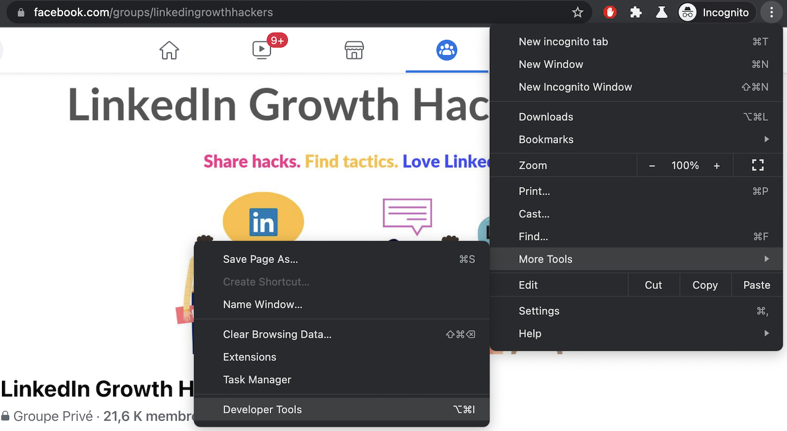
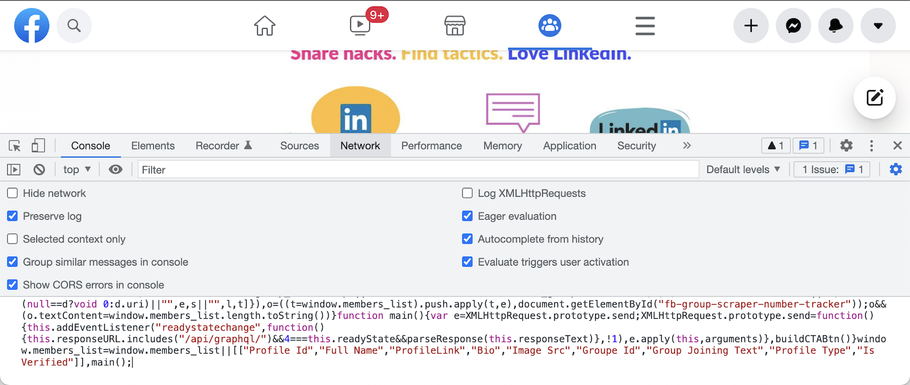

# Facebook Group Members Scraper

Script to scrape Facebook group members and export them into a CSV file. This Facebook Group members extractor works in the browser, without installing an extension or using a proxy. Just copy-paste the script into your Chrome console.

## How to run the Facebook Group Extractor script

 1. Go to a Facebook group page
 1. Open Chrome Developer Console
 1. Copy Paste the following code into the console. It will add a "Download 0 members" button
 1. Click on the "People" tab of the group page
 1. Scroll to load new members that will get caught by the script. The button counter increases with new members scraped.
 1. Once done, click on the "Download X members" button to download the generated CSV file

> [dist/main.min.js](dist/main.min.js)

```javascript
function exportToCsv(e,t){for(var n="",o=0;o<t.length;o++)n+=function(e){for(var t="",n=0;n<e.length;n++){var o=null===e[n]||void 0===e[n]?"":e[n].toString(),o=(o=e[n]instanceof Date?e[n].toLocaleString():o).replace(/"/g,'""');0<n&&(t+=","),t+=o=0<=o.search(/("|,|\n)/g)?'"'+o+'"':o}return t+"\n"}(t[o]);var i=new Blob([n],{type:"text/csv;charset=utf-8;"}),r=document.createElement("a");void 0!==r.download&&(i=URL.createObjectURL(i),r.setAttribute("href",i),r.setAttribute("download",e),document.body.appendChild(r),r.click(),document.body.removeChild(r))}function buildCTABtn(){var e=document.createElement("div"),t=(e.setAttribute("style",["position: fixed;","top: 0;","left: 0;","z-index: 10;","width: 100%;","height: 100%;","pointer-events: none;"].join("")),document.createElement("div")),n=(t.setAttribute("style",["position: absolute;","bottom: 30px;","right: 130px;","color: white;","min-width: 150px;","background: var(--primary-button-background);","border-radius: var(--button-corner-radius);","padding: 0px 12px;","cursor: pointer;","font-weight:600;","font-size:15px;","display: inline-flex;","pointer-events: auto;","height: 36px;","align-items: center;","justify-content: center;"].join("")),document.createTextNode("Download ")),o=document.createElement("span"),i=(o.setAttribute("id","fb-group-scraper-number-tracker"),o.textContent="0",document.createTextNode(" members"));return t.appendChild(n),t.appendChild(o),t.appendChild(i),t.addEventListener("click",function(){var e=(new Date).toISOString();exportToCsv("groupMemberExport-".concat(e,".csv"),window.members_list)}),e.appendChild(t),document.body.appendChild(e),e}function parseResponse(e){var t,n;try{t=JSON.parse(e)}catch(e){return void console.error("Fail to parse API response",e)}if(null!==(e=null==t?void 0:t.data)&&void 0!==e&&e.group)o=t.data.group;else{if("Group"!==(null===(e=null===(e=null==t?void 0:t.data)||void 0===e?void 0:e.node)||void 0===e?void 0:e.__typename))return;o=t.data.node}if(null!==(e=null==o?void 0:o.new_members)&&void 0!==e&&e.edges)n=o.new_members.edges;else{if(null===(t=null==o?void 0:o.new_forum_members)||void 0===t||!t.edges)return;n=o.new_forum_members.edges}var e=n.map(function(e){var t=e.node,n=t.id,o=t.name,i=t.bio_text,r=t.url,d=t.profile_picture,t=t.__isProfile,l=(null===(l=null==e?void 0:e.join_status_text)||void 0===l?void 0:l.text)||(null===(l=null===(l=null==e?void 0:e.membership)||void 0===l?void 0:l.join_status_text)||void 0===l?void 0:l.text),e=null===(e=e.node.group_membership)||void 0===e?void 0:e.associated_group.id;return[n,o,r,(null==i?void 0:i.text)||"",(null==d?void 0:d.uri)||"",e,l||"",t]}),o=((t=window.members_list).push.apply(t,e),document.getElementById("fb-group-scraper-number-tracker"));o&&(o.textContent=window.members_list.length.toString())}function main(){buildCTABtn();var e=XMLHttpRequest.prototype.send;XMLHttpRequest.prototype.send=function(){this.addEventListener("readystatechange",function(){this.responseURL.includes("/api/graphql/")&&4===this.readyState&&parseResponse(this.responseText)},!1),e.apply(this,arguments)}}window.members_list=window.members_list||[["Profile Id","Full Name","ProfileLink","Bio","Image Src","Groupe Id","Group Joining Text","Profile Type"]],main();
```


## Exported Fields

- **Profile Id**: Unique facebook identifier. Multi-digit number.
- **Full Name**: First name and last name concatenated.
- **Profile Link**: Profile URI in the format https://www.facebook.com/{{username}}. When not available, default to https://www.facebook.com/profile.php?id={{profile_id}}
- **Bio**: Profile bio text.
- **Image Src**: Profile picture URI.
- **Group Id**: Facebook group identifier. Multi-digit number.
- **Group Joining Text**: Relative time since user joined the group. In the format: "Member since XX".
- **Profile Type**: Facebook user category. Mostly "User".


## Group Members Extractor tutorial with screenshots

**Open Chrome Developer Console**

To open the Chrome Developer console on Chrome, use the keyboard shortcut `Ctrl + Shift + I` (on Windows) or `Cmd + Option + I` (on Mac).




**Copy Paste the script**

Select the "Console" tab and copy-paste the script from above. Facebook shows a warning message in the "Console" asking not to  paste a script from a non-trustworthy source. It's true! And if you don't trust this script, stop here. [Read the source code](main.ts) to understand what this script does.




**Click on the "People" tab and scroll to load new members**

In the Group Page, go to "People" and scroll to the bottom of the page. If the counter in the button text increases as your scroll, it's working!


**Export members in CSV format**

Once finished, or to perform "export checkpoints", click the button "Download X members". A Download window will prompt asking where to save your CSV file.


**Edit and view your CSV file**

[To load and view the CSV file](https://www.datablist.com/csv-editor), use [Datablist.com](https://www.datablist.com/) or any spreadsheet tools.


## FAQ

- **How to remove the "Download" button?**
    - Just reload your Facebook page. Any javascript code added in Chrome Developer Console will be removed.
- **How many members can be extracted for one group?**
    - Facebook loads a maximum of 10k profiles in the "People" tab. We recommend extracting new members on a regular basis. And then, [consolidate all your members in a single list using Datablist.com](https://www.datablist.com).
- **Can I extract members from different groups at one time?**
    - Yes. The exported CSV contains a "Group Id" attribute. Load members from one Facebook group, go to another group page (without reloading your page), load members, and click "Download". Members extracted from both groups will be in a single CSV file with different "Group Id" values.


## How to build it locally

```
yarn install
yarn build
```


The generated script is located in `dist/main.min.js`.
